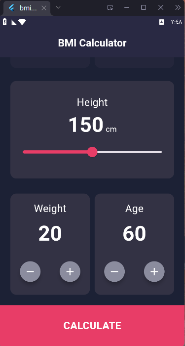
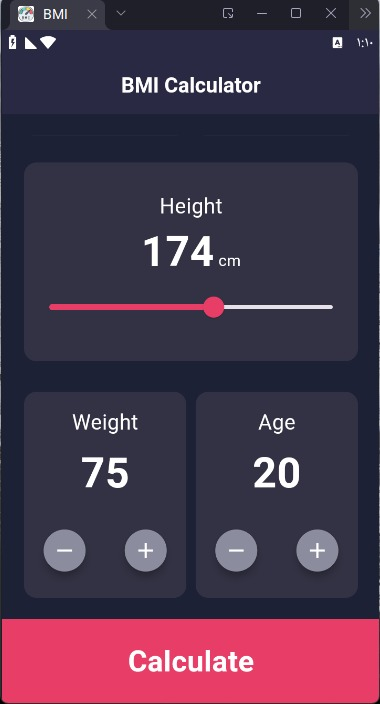
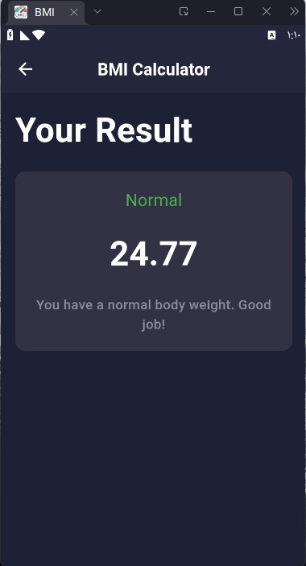
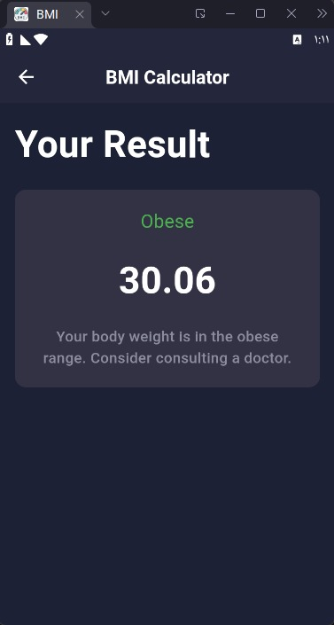
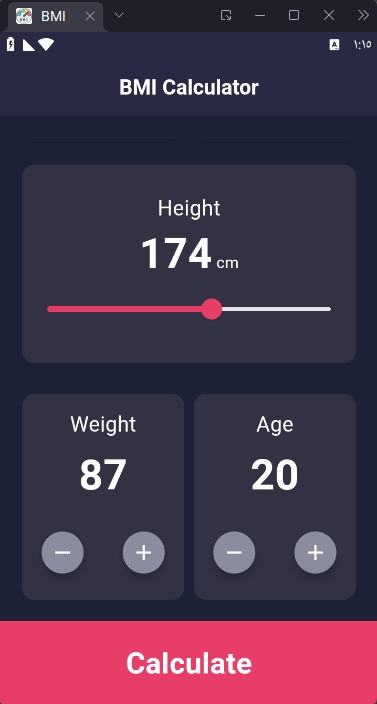
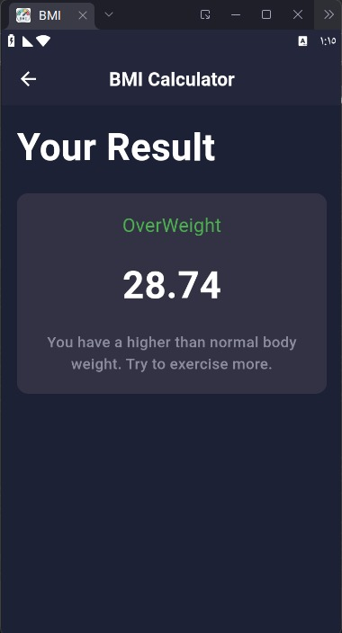
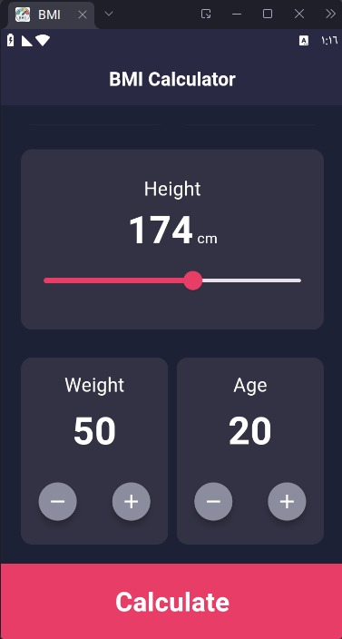
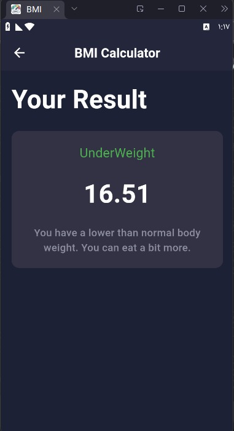

# bmi_eraasoft

A new Flutter project.

## Getting Started

This project is a starting point for a Flutter application.

A few resources to get you started if this is your first Flutter project:

- [Lab: Write your first Flutter app](https://docs.flutter.dev/get-started/codelab)
- [Cookbook: Useful Flutter samples](https://docs.flutter.dev/cookbook)

For help getting started with Flutter development, view the
[online documentation](https://docs.flutter.dev/), which offers tutorials,
samples, guidance on mobile development, and a full API reference.

# My post

Check out my LinkedIn post about Clean Code and Flutter:

[Clean Code & Flutter Post](https://www.linkedin.com/posts/mostafa-mahmoud-azab-6241b41ba_cleancode-dry-flutter-activity-7406367810374938624-fwPL?utm_source=share&utm_medium=member_desktop&rcm=ACoAADLuRXwBJvKUUWoCFBgPkq1ob1EVTBVJ5c8)

## Screenshot one

### Screenshot two

#### Screenshot three

##### Screenshot four

###### Screenshot Normal0

###### Screenshot Normal

###### Screenshot Normal

###### Screenshot Obese0

###### Screenshot Obese

###### Screenshot OverWeight0

###### Screenshot OverWeight

###### Screenshot UnderWeight0

###### Screenshot UnderWeight

